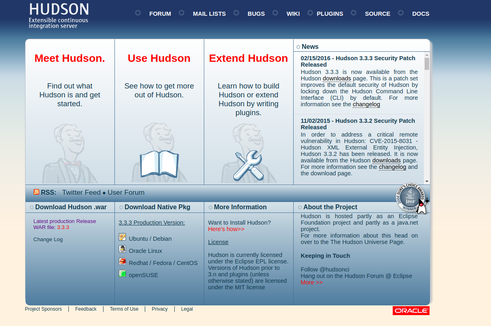
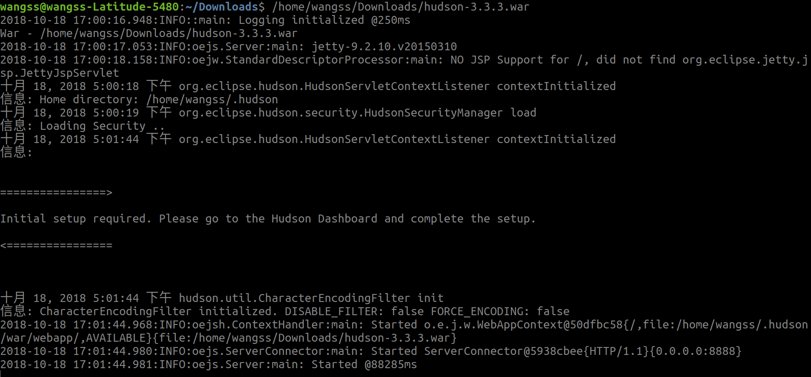
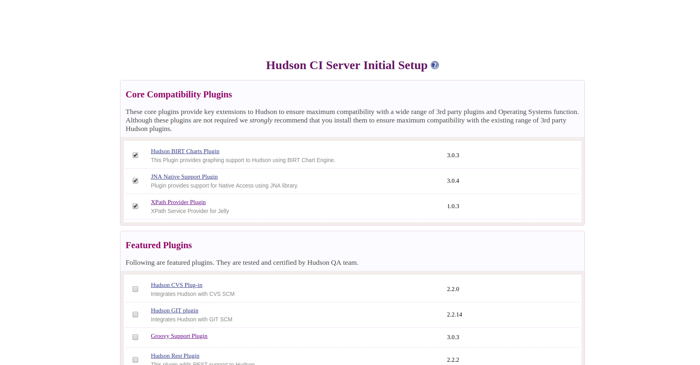

#Hudson的安装和使用  

##一、部署环境
+ 一台linux虚拟机
+ 服务器：tomcat
+ 应用

##二、环境搭建
1. 下载Hudson，安装部署[官网地址](http://hudson-ci.org/)

2. 执行war文件  
`java -jar hudson-3.0.1.war --httpPort=8888&`

3. 程序启动以后，在游览器中输入：http://localhost:8888/  

在页面的底部有 install 按钮，点击执行，等待安装  

##三、新建部署项目
1. 新建项目

2. 部署项目
